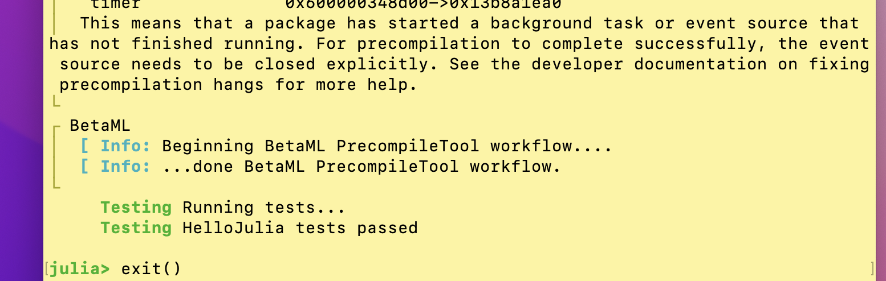

# Demos and Tutorials

## Setup

Setup is in **five** steps, first installing Julia, then installing packages that the workshop will require. Each step only needs to be executed successfully once.

1. If you are a Windows user, install [Windows Terminal](https://aka.ms/terminal) and make
   sure you know how to open a new terminal process (window), into which you can type
   commands. If the link doesn't work, try a different browser. Windows Terminal will be how
   you run Julia in this workshop. If you are a macOS or Linux user, you can use the Terminal app
   that comes with your operating system.

3. Follow [these official installation instructions](https://julialang.org/downloads/).
  
4. Open a terminal window and type `julia`, and press `RETURN` or `ENTER`. This
  launches a Julia session, a command-line interface for interacting with julia called
  the [REPL](https://en.wikipedia.org/wiki/Read–eval–print_loop).

6. *Testing.* At the `julia> ` prompt, type `println("Hello world!")` and press `RETURN`
  or `ENTER`. The words "Hello world!" should be repeated back to you. This confirms Julia is installed.
  Quit the Julia session by typing `exit()` or entering `CONTROL+D`.


5. **In a new Julia session** type the following at the `julia>` prompt, inlcuding a
   RETURN at the end of each line (or do copy/paste + one final RETURN):

```julia
ENV["JULIA_PKG_PRECOMPILE_AUTO"]=0
using Pkg
Pkg.activate(temp=true)
Pkg.develop(url="https://github.com/ablaom/HelloJulia.jl")
Pkg.activate(joinpath(Pkg.devdir(), "HelloJulia"))
Pkg.instantiate()
Pkg.build("Conda")
Pkg.build("IJulia")
ENV["JULIA_PKG_PRECOMPILE_AUTO"]=1

using HelloJulia
using Pkg
Pkg.test("HelloJulia")
exit()
```
This will take about 15 - 20 minutes to run through. 

**On Windows, you may get a message from Windows Defender Firewall** stating it has blocked Julia's network access. Press
_Allow access_ to continue.

Once finished, you should see something roughly like this:



**IF YOU ARE PREPARING FOR A JULIA WORKSHOP** you can stop now. You're ready for the
workshop! 

## Running the demos and tutorials

!!! Note

    Running notebooks for the first time may involve delays due to 
	precompilation of newly installed packages.

After starting a new Julia session, enter these commands:

```julia
using Pkg; Pkg.activate(joinpath(Pkg.devdir(), "HelloJulia"))
using HelloJulia
```

Then: 

### Option 1: To run as Pluto notebooks

- Enter `pluto()` at the `julia>` prompt.

To kill the notebook server when finished, navigate to the window running Julia and enter
CONTROL-C.

### Option 2: To run as Jupyter notebooks

- Enter `juptyer()` at the `julia>` prompt. If asked, agree to install Jupyter using
  Conda.

- In the browser window that should appear, navigate to the folder of interest

- Choose the file called `notebook.unexecuted.ipynb` (or
  `notebook.ipynb` to see pre-executed version)
  
To kill the notebook server when finished, navigate to the window running Julia and enter
CONTROL-C.

### Option 4: To run as script in your editor

For more experienced users and instructors.

Clone this repository locally and navigate to the appropriate
sub-folder of `/notebooks`. Open the file `notebook.jl` in your
Julia-enabled IDE.

---

[](https://github.com/ablaom/HelloJulia.jl/actions) 
